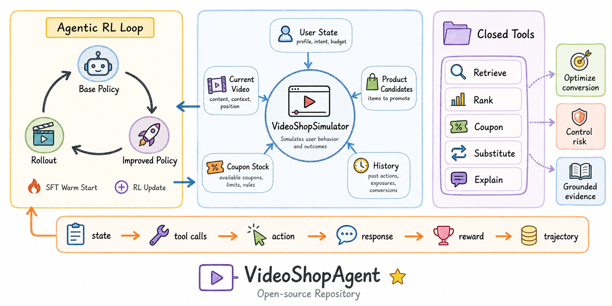

# VideoShopAgent

[English](README.md) | [简体中文](README.zh-CN.md)

VideoShopAgent 是一个面向短视频内容电商的开源仿真环境与 Agent 训练评测基准，用于研究智能策略如何联合优化内容分发、商品曝光、促销干预和长期用户价值。

核心环境 `VideoShopEnv` 模拟 Agent 在用户、商品、库存、促销和风险约束下，如何决定何时以及如何介入内容流。本项目聚焦在搜索、推荐、广告和多模态理解之上的 Agentic decision layer，并生成可用于 SFT、DPO、RL rollout 和离线 Agent 评测的结构化轨迹。



## 核心特性

- 面向短视频电商的环境状态，包含用户、会话、视频、商品和商业上下文。
- 闭集工具和动作空间，便于控制 Agent 行为并进行可重复评测。
- Reward 覆盖转化、优惠券正确性、替代品选择、证据 grounding、用户打扰、类目错配和退货风险。
- 提供规则策略和随机策略 baseline。
- 生成 JSONL 轨迹，包含 state、tool calls、action、user response、reward 和 state transition。
- 支持导出 SFT、DPO preference pairs 和 RL rollouts。
- DPO hard negatives 覆盖真实电商 Agent 常见错误。
- v0.2 Feed 决策层：Agent 直接选择下一次 `user x video x product x treatment` 曝光，配套多目标 reward 向量和明确的公开／隐藏场景边界。

## 两层环境

项目由两个决策单元组合出三个环境，各自独立版本化，不可互换。

```text
FeedControlEnv      (v0.2, schema v2)  -> 决定下一次曝光
VideoShopEnv        (v0.1, schema v1)  -> 在既定视频上决定商业干预
FeedInterventionEnv (v0.2, schema v2)  -> 两层组合
```

`VideoShopEnv` 是干预层：环境选定 `current_video`，Agent 只决定在该视频上的商业处置。`FeedControlEnv` 位于其上，把曝光本身交给 Agent，包括是否干脆只投普通内容。

`FeedInterventionEnv` 把两层真正接在一起。Feed 策略先选曝光；若是商业曝光，干预层再走原有的 `ToolRuntime` 和证据校验，决定"怎么呈现"。候选上的 `treatment` 因此只是**报价**，不是既成事实：

```text
feed 策略    -> serve_exposure(X03_02)          视频 + 锚定商品 + 报价 treatment
干预层       -> get_coupon(...) -> 不可用        工具决定真实情况
             -> show_product_card               实际 treatment，券被拒掉
用户模型     -> 对"实际曝光"作出反应
```

这也让优惠券这条轴不再是摆设。一部分券曝光（`coupon_trap_rate`）宣称有券但实际无法核销，只有 `ExposureTruth.coupon_available` 是权威。陷阱从外部不可见：ranker 的 `base_scores` 按"宣称的券"给分，feed-only 策略无从分辨真假；而无法核销的券在**两个环境里**都不带来转化提升、也不带来折后价。只有 `get_coupon` 能定论。

因此干预层是一个**责任面**而不是加分项。未经核验就展示优惠券会记一条 `fake_coupon` violation 并计入 `risk_cost`——这把 v1 的证据约束 penalty 带进了 v2 reward vector，而不是在组合时悄悄丢掉。内置两个基线：`anchor_rule_based` 先验证再展示，`trusting` 直接照搬报价。

```text
smoke，--coupon-treatment-rate 0.6   feed-only   +anchor   +trusting
greedy_gmv                              -2.54     -2.53      -3.57
rule_based                              +2.36     +2.36      +2.01
always_organic                          +2.21     +2.21      +2.21
```

会验证的 Agent 回到 feed-only 的结果，不验证的要付代价。`always_organic` 三列完全一致，因为它从不投商业曝光，干预层根本不会触发。

默认配置下优惠券只占候选的约 5%，太稀疏，测不出上面的差异；用 `--coupon-treatment-rate` 和 `--coupon-trap-rate` 可以加压这条轴。

证据需要三方绑定：工具输入、工具输出、以及 action 最终落到的商品。引用一次真实的 `find_substitute` 结果、却换成另一个商品，属于 violation 而不是放行。Feed 层的绑定同样成立：视频固定，离开锚定商品只有通过 `find_substitute` 才合法。

拒绝商品干预会保留曝光的 `source_type`：被拒的广告仍是广告供给，只是 `treatment="none"`，不会被重分类为 organic——否则 Agent 就能凭空甩掉广告疲劳和风险成本。

干预 Agent 看到的不是 v1 的 `Observation`。`FeedInterventionEnv` 会构造 `InterventionObservation`：公开 `anchor_product_id`、`offered_treatment`、`source_type`，去掉 `coupon_inventory`／threshold／expiry。券能不能核销只能通过 `get_coupon` 得知。把裸的 `FunctionCallingAgent` 丢进组合环境会自动改写它的 v1 brief；显式工厂是 `build_intervention_agent`。每条 intervention record 保留完整 `agent_step`（tool requests、`reasoning_summary`、tool-call trace、当时用的 system prompt），因此 episode 可训练，而不只是可打分。

## 干预环境（VideoShopEnv）

每个 `VideoShopEnv` episode 表示一次短视频购物会话。下一条视频由环境选择，而非 Agent。

```text
state
  -> tool calls
  -> final action
  -> simulated user response
  -> reward
  -> state update
  -> next video（由环境选择）
```

State 包含：

- `user_profile`：国家、预算水平、风格偏好、类目兴趣、价格敏感度、风险敏感度、广告疲劳度、购买意图。
- `session_state`：当前步数、最近观看类目、点击、加购、跳过、已曝光商品、已使用优惠券。
- `current_video`：标题、场景、类目、检测物体、风格、创作者类型。
- `candidate_products`：标题、类目、价格、评分、库存、评论风险、毛利/清仓标签、优惠券信息。
- `commerce_context`：券库存、券门槛、券过期步数、活动预算、库存压力、风险约束。

## 工具与动作

闭集工具，以下为 Agent 实际可传的参数。用户、视频、约束等由环境自行填充，不属于可调用签名：

```text
retrieve_candidates(limit?)
rank_products(candidate_product_ids?)
get_coupon(product_id)
find_substitute(product_id)
explain_recommendation(product_id)
```

`find_substitute` 的约束由场景决定，`explain_recommendation` 的 evidence 是工具输出，两者都不接受这些作为入参。

最终动作：

```text
delay_recommendation
show_product_card(product_id)
show_coupon(product_id)
switch_to_substitute(product_id)
show_explanation(product_id)
```

## Reward

正向信号：

```text
点击商品卡
加入购物车
成单代理分
有效使用优惠券
有效替代商品
有证据的推荐解释
```

惩罚项：

```text
错类目推荐
虚假优惠券
高退货风险未解释
无证据解释
打扰用户体验
退货或退款
```

Reward 由结构化日志和工具证据计算，不依赖单一 LLM-as-judge。

## Feed 决策核心（v0.2）

`FeedControlEnv` 把曝光选择本身作为决策。每一步 Agent 都会收到一个有限候选集，其中必定同时存在普通内容和商业内容，并从中投放恰好一条。

```text
CandidateProvider
  -> FeedControlEnv (serve_exposure)
  -> 用户响应
  -> RewardVector
  -> 下一批候选
```

`ExposureCandidate` 是一个 `user x video x product x treatment` 单元：

```text
exposure_id, video_id
source_type:  organic | seller | affiliate | ad
product_id:   organic 为空
treatment:    none | product_anchor | coupon
placement:    for_you | search | shop_tab
base_scores:  expected_watch_time, skip_probability, product_click_probability,
              purchase_probability, expected_net_gmv, refund_probability
eligibility:  in_stock, coupon_valid, policy_compliant, risk_within_limit, audience_allowed
```

协议保证，均有测试覆盖：

- 普通内容是正式候选。“不做商业干预”表现为投放普通内容而不是空等，并且每一步都至少存在一个可投放的 organic 候选。
- 视频与商品的绑定属于候选事实。`FeedDecision` 只携带 `exposure_id`，Agent 在结构上无法把商品换绑到其他视频。
- 不满足硬约束的候选由环境拦截，绝不会触达用户；该决策只会付出 reward 代价。
- `base_scores` 是对隐藏响应参数加噪且偏乐观的估计，策略无法从 observation 反推真值。
- `ScenarioSpec` 区分 `public_context` 与 `hidden_world_state`、`oracle`，并在构造时扫描 instruction 的答案泄漏。
- 仅支持 Top-1 `serve_exposure`。`rank_exposures` 刻意推迟到 Top-1 协议稳定之后。

Reward 是向量，由具名目标配置标量化：

```text
content_value, commerce_value, user_value, ecosystem_value, risk_cost
profiles: content_first | balanced | gmv_first | retention_first | clearance_campaign
```

`risk_cost` 是非负量，标量化时做减法；每个分量都带 per-term 明细，任何 reward 数值都能回溯到产生它的事件。

运行 benchmark：

```bash
python scripts/run_feed_benchmark.py --policy all --split smoke
python scripts/run_feed_benchmark.py --policy all --split smoke --intervention anchor_rule_based
```

100 条 smoke 场景上的 baseline（seed 42，6 步，平均标量 reward）：

| 策略 | Reward | 95% CI | 商业曝光占比 | Gold@1 |
| --- | --- | --- | --- | --- |
| `greedy_gmv` | -1.98 | [-2.52, -1.45] | 0.97 | 0.11 |
| `random` | -1.50 | [-1.93, -1.08] | 0.59 | 0.20 |
| `rule_based` | 2.27 | [1.54, 3.04] | 0.27 | 0.68 |
| `always_organic` | 2.38 | [1.70, 3.01] | 0.00 | 0.67 |
| `oracle_step_greedy` | 2.84 | [2.12, 3.64] | 0.27 | 1.00 |

`greedy_gmv` 相信 ranker 的乐观分数，结果是输的：过度商业化会提前终止会话。`always_organic` 是很强的下限，且置信区间与 `rule_based` 重叠——也就是说手写规则并没有稳定地胜过"完全不投商业内容"；两者在 `frozen_eval`（2.33 对 2.24）以及 `gmv_first`、`clearance_campaign` 目标上才分得开。Oracle 靠约 27% 的商业曝光高于两者，说明商业轴不是摆设。`oracle_step_greedy` 读取环境私有状态，是天花板参考而非合法 Agent。

### Split 划分

Split 为 `smoke`（100 场景）、`train`（500）、`frozen_eval`（200）。它们切分的是**实体**而不只是随机种子：一个包含 1080 商品、300 视频、150 用户的世界被划成互不相交的实体池，并在品类内分层，使每个 split 仍然覆盖全部 12 个品类。

```text
train        648 商品   180 视频   90 用户
smoke        216 商品    60 视频   30 用户
frozen_eval  216 商品    60 视频   30 用户
```

任何商品、视频、用户 id 都不会出现在两个 split 中。每个 split 自带生成它的 provider，因此一个 episode 的第 0 步与后续步骤使用同一份 catalog。报告中会带上 `dataset_hash`、provider 配置和实体池规模。

这层配对是**强制**的而不是靠约定。`run_feed_benchmark` 接受一个 `FeedSplit`，或者同时接受 `scenarios` 和 `provider`，只给其一会直接报错——此前只传 scenarios 会回退到默认 split 的 provider，把 frozen_eval 场景悄悄跑在 smoke catalog 上。`FeedControlEnv.reset` 是兜底：provider 不拥有的实体会被拒绝，包括"id 对得上但属性不同"这种隐蔽情况。

## 快速开始

以 editable 模式安装：

```bash
pip install -e .
```

生成 mock trajectories：

```bash
python scripts/generate_mock_trajectories.py --episodes 100 --seed 42
```

导出训练数据：

```bash
python scripts/export_training_data.py \
  --input outputs/trajectories/mock_trajectories.jsonl \
  --out-dir outputs/datasets
```

运行测试：

```bash
python -m pytest
```

## 输出

轨迹生成输出：

```text
outputs/trajectories/mock_trajectories.jsonl
outputs/reports/mock_eval_summary.json
```

训练数据导出输出：

```text
outputs/datasets/sft.jsonl
outputs/datasets/dpo_pairs.jsonl
outputs/datasets/rl_rollouts.jsonl
```

评测摘要示例：

```json
{
  "episodes": 100,
  "avg_reward": 10.25,
  "avg_steps": 6.35,
  "ctr": 0.4724,
  "add_to_cart_rate": 0.2063,
  "purchase_rate": 0.39,
  "interruption_rate": 0.2409,
  "policy": "RuleBasedPolicy"
}
```

## 训练数据

SFT 样本用于动作模仿：

```text
messages:
  system: Agent 角色和约束
  user: 当前 VideoShopEnv state
  assistant: 工具调用和最终动作
```

DPO pairs 用于训练电商约束下的动作偏好：

```text
prompt: 当前状态
chosen: 策略动作
rejected: hard negative 动作
metadata: reward, outcome, negative_type
```

支持的 hard negative 类型：

```text
fake_coupon
missed_substitute
high_risk_unexplained
category_mismatch
premature_intervention
unsupported_explanation
```

RL rollouts 提供 transition 级数据：

```text
state
tool_calls
action
reward
user_response
state_update
next_state
done
```

## 项目结构

```text
VideoShopAgent/
  configs/
  data/
    raw/
    processed/
    synthetic/
  docs/
  notebooks/
  examples/
  outputs/
    trajectories/
    reports/
    datasets/
    benchmarks/
    feed_benchmarks/
  scripts/
    generate_mock_trajectories.py
    export_training_data.py
    run_benchmark.py
    run_feed_benchmark.py
    generate_llm_trajectories.py
    convert_gold_trajectories.py
  src/videoshop/
    agents/
    data/
    feed/
    policies/
    simulator/
    training/
  tests/
```

`src/videoshop/feed/` 是 v0.2 层：`schemas.py`、`candidate_provider.py`、`control_env.py`、`composite_env.py`、`user_model.py`、`reward.py`、`policies.py`、`scenarios.py`、`splits.py`、`benchmark.py`、`legacy.py`。

## Schema 版本

轨迹自带版本。版本化之前写出的 episode 按定义视为 v1。

```text
v1  VideoShopEnv 干预层 episode（已冻结）
v2  FeedControlEnv / FeedInterventionEnv 曝光 episode
```

`videoshop.feed.legacy.upgrade_v1_episode` 把 v1 episode 投影到 v2 信封，并将旧动作映射为 treatment（`show_coupon` 映射为 `coupon`，`delay_recommendation` 映射为 organic，依此类推）。它把原始标量保留在 `legacy_reward`，而不是伪造一个 v1 从未记录过的 reward 向量。

v1 episode 存在两种结构，适配器两种都读：rollout 和 benchmark episode 把决策放在 `action`，而 LLM tool-calling episode 放在 `agent_step.final_action`，且根本没有 `action` 这个 key。两者都不匹配的 step 会直接报错而不是走默认值——正是这个默认值曾把全部商业决策静默改写成 organic 空操作。可恢复但结构异常的记录（例如 `product_id` 为 null 的 `show_product_card`）会被降级并记入 `conversion_warnings`。`outputs/llm_trajectories/` 下已有的 Qwen、DeepSeek 轨迹被直接用作回归测试样本。

## Roadmap

- Top-1 feed 协议稳定后增加 `rank_exposures`。
- 让 feed 层为同一 `video x product` 同时给出多种 treatment 候选，使 treatment 成为 feed 层的选择维度，而不只是干预层的。
- 在 `FeedInterventionEnv` 上评测 LLM Agent。观察协议和可训练轨迹已经就绪；下一步是真实 Qwen／DeepSeek 评测，优先级高于 `rank_exposures`。
- 清理 v1 synthetic 场景 objective 中仍然直接点名预期动作的答案泄漏。
- 增加 risk-aware、coupon-aware、conversion-greedy 等 baseline policy。
- 为 DPO rejected actions 增加 counterfactual reward 估计。
- 扩展 mock 场景，加入更丰富的商品池和用户群体。
- 使用公开行为数据校准用户响应概率。
- 加入视频和商品多模态 embedding，增强内容-商品 grounding。
- 增加 LLM tool-calling policy，用于离线对比。

## License

本项目使用 Apache-2.0 License。外部数据集需遵守其各自的 license 和使用条款。

## Toy Benchmark

运行固定的 VideoShopEnv toy benchmark：

```bash
python scripts/run_benchmark.py --policy rule_based --episodes-per-scenario 1 --seed 42
```

输出文件：

```text
outputs/benchmarks/toy_episodes.jsonl
outputs/benchmarks/toy_summary.json
```

当前 toy split 包含 10 个固定场景，覆盖有效优惠券、虚假优惠券陷阱、高风险商品、替代品、广告疲劳、类目错配、过期优惠券、库存压力、grounded explanation 和低库存保护。

如果要生成更大规模冷启动数据，可以使用 synthetic commerce split：

```bash
python scripts/run_benchmark.py \
  --split synthetic \
  --policy rule_based \
  --synthetic-categories 12 \
  --synthetic-products-per-category 80 \
  --synthetic-scenarios 50 \
  --synthetic-candidate-pool-size 32 \
  --out outputs/benchmarks/synthetic_episodes.jsonl \
  --report outputs/benchmarks/synthetic_summary.json
```

synthetic split 会生成更大的商品目录、优惠券库存、库存压力、用户画像、视频流和类型化场景，包括有效优惠券、虚假优惠券陷阱、高风险解释、替代品、疲劳延迟、低库存保护、清仓库存压力和类目错配陷阱。每个 scenario 只暴露有限候选池，避免 prompt 过长，同时底层 catalog 可以继续扩大。

## Function Calling Agent

VideoShopEnv 内部仍以 `AgentStep` 作为标准协议，同时在 `videoshop.agents` 下新增了 provider 风格 function/tool calling 适配层。最小脚本示例：

```bash
python examples/function_calling_agent.py
```

当前工具 schema 包括 `retrieve_candidates`、`rank_products`、`get_coupon`、`find_substitute`、`explain_recommendation` 和 `submit_final_action`。外部模型返回的 tool calls 会先归一化为 `AgentStep`，再传给 `env.step_agent(...)`。

### SGLang / OpenAI-compatible endpoint

如果使用 OpenAI-compatible 的 SGLang 内网接口，建议用环境变量配置，不要把 Key 写入代码：

```bash
export VIDEOSHOP_LLM_BASE_URL="http://113.128.201.101:8001/v1"
export VIDEOSHOP_LLM_MODEL="Qwen3.8-27B"
export VIDEOSHOP_LLM_API_KEY="<your-api-key>"
python examples/qwen_sglang_agent.py
```

### 生成 LLM tool-calling 轨迹

配置 OpenAI-compatible 接口后，可以保存真实 LLM tool-calling 轨迹：

```bash
python scripts/generate_llm_trajectories.py --episodes-per-scenario 1 --max-scenarios 10
```

synthetic LLM 轨迹也使用同一套 split 参数：

```bash
python scripts/generate_llm_trajectories.py \
  --split synthetic \
  --episodes-per-scenario 1 \
  --synthetic-scenarios 50 \
  --synthetic-categories 12 \
  --synthetic-products-per-category 80 \
  --synthetic-candidate-pool-size 32 \
  --out outputs/llm_trajectories/qwen_synthetic_tool_calling.jsonl \
  --report outputs/llm_trajectories/qwen_synthetic_tool_calling_summary.json
```

输出文件：

```text
outputs/llm_trajectories/qwen_tool_calling.jsonl
outputs/llm_trajectories/qwen_tool_calling_summary.json
```

每个 step 会记录 observation、模型 tool requests、final action、显式 `reasoning_summary`、实际执行的 tool results、reward、user response、state update、终止标记和 constraint violations。`reasoning_summary` 是要求模型输出的可审计推理摘要，不是隐藏 chain-of-thought。
